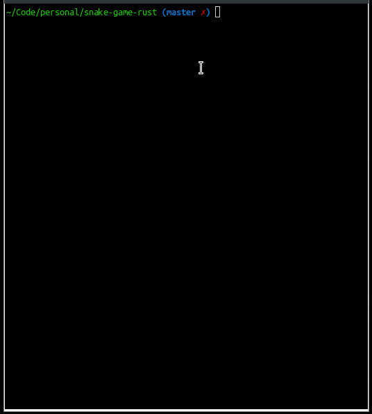

# Snake Game

This project implements an elementary version of the Snake Game.



## Installation

Compile and run with [Cargo](https://doc.rust-lang.org/cargo/).

## Usage

You can run the game with:

```bash
cargo run
```

The game stops if the snake hits a wall or if you press `q`.

## To Do

+ [x] Make the snake grow by eating food
+ [ ] Add different difficulty levels (making the snake move faster)
